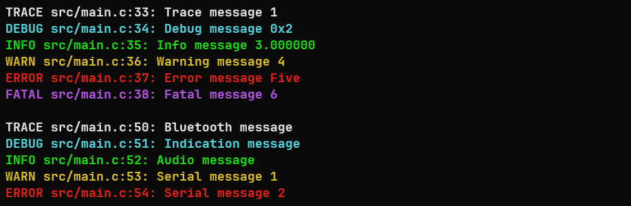
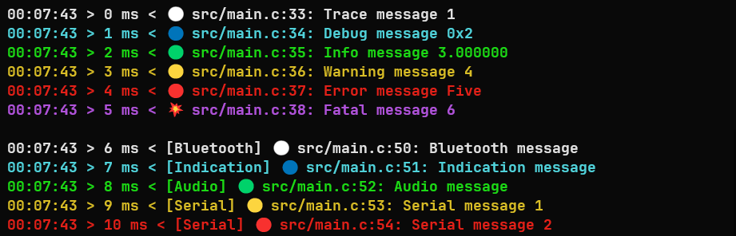

# microlog


A simple customizable logging library.

In the default configuration it looks like this:



...but in can be very minimalistic


... or feature-rich:



## Table of Contents

- [microlog](#microlog)
    - [Table of Contents](#table-of-contents)
    - [Usage](#usage)
        - [ulog\_set\_quiet(bool enable)](#ulog_set_quietbool-enable)
        - [ulog\_set\_level(int level)](#ulog_set_levelint-level)
        - [Advanced Functions](#advanced-functions)
            - [ulog\_add\_fp(FILE \*fp, int level)](#ulog_add_fpfile-fp-int-level)
            - [ulog\_add\_callback(ulog\_LogFn fn, void \*udata, int level)](#ulog_add_callbackulog_logfn-fn-void-udata-int-level)
            - [ulog\_set\_lock(ulog\_LockFn fn, void \*udata)](#ulog_set_lockulog_lockfn-fn-void-udata)
            - [const char\* ulog\_get\_level\_string(int level)](#const-char-ulog_get_level_stringint-level)
            - [ulog\_set\_prefix\_fn(ulog\_PrefixFn function)](#ulog_set_prefix_fnulog_prefixfn-function)
        - [Customization](#customization)
            - [Customization defines](#customization-defines)
    - [License](#license)
    - [Credits](#credits)

## Usage

The library can be linked as a CMake project or can be added manually:
copy **[ulog.c](src/ulog.c?raw=1)** and **[ulog.h](include/ulog.h?raw=1)** into your project and compiled along with it.

The library provides 6 function-like macros for logging:

```c
log_trace(const char *fmt, ...);
log_debug(const char *fmt, ...);
log_info(const char *fmt, ...);
log_warn(const char *fmt, ...);
log_error(const char *fmt, ...);
log_fatal(const char *fmt, ...);
```

Each function takes a printf format string followed by additional arguments:

```c
log_trace("Hello %s", "world")
```

Resulting in a line with the given format printed to stderr:

```
20:18:26 [TRACE] src/main.c:11: Hello world
```

### ulog_set_quiet(bool enable)

Quiet-mode can be enabled by passing `true` to the `ulog_set_quiet(` function.
While this mode is enabled the library will not output anything to `stderr`, but will continue to write to files and callbacks if any are set.

### ulog_set_level(int level)

The current logging level can be set by using the `ulog_set_level()` function.
All logs below the given level will not be written to `stderr`. By default the
level is `LOG_TRACE`, such that nothing is ignored.

### Advanced Functions

#### ulog_add_fp(FILE *fp, int level)

One or more file pointers where the log will be written can be provided to the
library by using the `ulog_add_fp()` function. The data written to the file
output is of the following format:

```
2047-03-11 20:18:26 [TRACE] src/main.c:11: Hello world
```

Any messages below the given `level` are ignored. If the library failed to add a
file pointer a value less-than-zero is returned.

#### ulog_add_callback(ulog_LogFn fn, void *udata, int level)

One or more callback functions which are called with the log data can be provided to the library by using the `ulog_add_callback()` function. A callback function is passed a `ulog_Event` structure containing the `line` number, `filename`, `fmt` string, `va` printf va\_list, `level` and the given `udata`.

#### ulog_set_lock(ulog_LockFn fn, void *udata)

If the log will be written to from multiple threads a lock function can be set.
The function is passed the boolean `true` if the lock should be acquired or `false` if the lock should be released and the given `udata` value.

#### const char* ulog_get_level_string(int level)

Returns the name of the given log level as a string.

#### ulog_set_prefix_fn(ulog_PrefixFn function)

Sets a custom prefix function. The function is called with the log level and should return a string that will be printed before the log message. Requires `ULOG_CUSTOM_PREFIX_SIZE` to be more than 0.

### Customization

#### Customization defines

- `ULOG_NO_COLOR` - Do not use ANSI color escape codes when printing.
- `ULOG_HIDE_FILE_STRING` - Hide the file name and line number.
- `ULOG_SHORT_LEVEL_STRINGS` - Use short level strings, e.g. "T" for "TRACE", "I" for "INFO".
- `ULOG_USE_EMOJI` - Use emojis for log levels (⚪, 🟢, 🔵, 🟡, 🟠, 🔴, 💥). Overrides `ULOG_SHORT_LEVEL_STRINGS`. WARNING: not all compilers support emoji.
- `ULOG_HAVE_TIME` - Print the time in the log messages if the platform supports time.h.
- `ULOG_EXTRA_DESTINATIONS` - The maximum number of extra logging destinations that can be added. Each extra destination requires some memory. When it is 0, the entire extra destination code is not compiled. Default is 0.
- `ULOG_CUSTOM_PREFIX_SIZE` - The maximum size of the custom prefix. Default is 0. If set to 0, the custom prefix code is not compiled. If set to a value greater than 0, the custom prefix can be set with `ulog_set_custom_prefix(ulog_PrefixFn func)`.

You can use the defines in the compiler options, e.g. `-DULOG_NO_COLOR`.

For CMake projects, you can use the `add_definitions` function.

```cmake
add_definitions(-DULOG_NO_COLOR)
```

For Meson projects, you can use the `meson` command.

```meson
add_global_arguments('-DULOG_NO_COLOR', language: 'c')
```

Note: You might want to adjust the compiler argument  `-fmacro-prefix-map=OLD_PATH=NEW_PATH` to to get the right file paths, e.g. for meson:

```meson
add_global_arguments('-fmacro-prefix-map=../=',language: 'c')
```

## License

This library is free software; you can redistribute it and/or modify it under the terms of the MIT license. See [LICENSE](LICENSE) for details.

## Credits

Based on <https://github.com/rxi/log.c.git>
