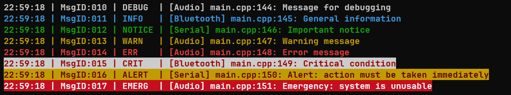

# microlog

[](https://github.com/an-dr/microlog/tags)
[](https://github.com/an-dr/microlog/actions/workflows/workflow-tests.yml)

A simple customizable logging library. Features:

- **Log topics**
    - To filter log messages by subsystems, e.g. "network", "storage", etc.
- **Callbacks for custom output**
    - E.g. files, serial ports, etc.
- **Thread-safety**
    - Via external locking injection
- **Customizable log format**
    - Color, custom dynamic data, emojis, etc.
- **Support for embedded systems**
    - Optional static memory allocation, optional color, no special dependencies

In the default configuration it looks like this:


...but in can be very minimalistic


... or feature-rich:



The project is based on several core principles:

- Universal for embedded and desktop applications
- No feature - no code for compilation
- Shallow learning curve, works out of box
- No dependencies
- Two files

## Table of Contents

- [microlog](#microlog)
    - [Table of Contents](#table-of-contents)
    - [Quick Start](#quick-start)
        - [Install](#install)
        - [Use](#use)
    - [User Manual](#user-manual)
        - [Basics](#basics)
        - [Log Verbosity](#log-verbosity)
        - [Thread-safety](#thread-safety)
        - [Log Topics](#log-topics)
        - [Extra Outputs](#extra-outputs)
            - [File Output](#file-output)
            - [Custom Output](#custom-output)
        - [Custom Log Prefix](#custom-log-prefix)
        - [Timestamp](#timestamp)
        - [Other Customization](#other-customization)
    - [Contributing](#contributing)
    - [License](#license)
    - [Credits](#credits)

## Quick Start

### Install

**Option 1 - Sources**:

- Download a Source Package from [Releases](https://github.com/an-dr/microlog/releases)
- Add sources to your system manually

**Option 2 - CMake Package (recommended CMake > 3.15.0)**:

- Download a CMake Package from [Releases](https://github.com/an-dr/microlog/releases)
- Specify the install location:
    - Specify package storage `cmake -B./build -DCMAKE_PREFIX_PATH="~/MyCmakePackages"` or
    - Set `microlog_DIR` variable with path to the package `microlog_DIR=~/microlog-1.2.3-cmake`
- Use in your project:

```cmake
find_package(microlog 1.2.3 REQUIRED)

add_executable(example_package example.cpp)
target_link_libraries(example_package PRIVATE microlog::microlog)

add_compile_definitions(ULOG_NO_COLOR) # configuration
```

**Option 3 - Meson Package**:

- Download a Meson Package from [Releases](https://github.com/an-dr/microlog/releases)
- Copy the content to `MyMesonProject/subprojects`
- Add to your dependencies:

```meson
add_global_arguments('-DULOG_NO_COLOR', language: ['cpp', 'c']) # configuration

exe = executable(
    meson.project_name(),
    src,
    include_directories: include,
    dependencies: dependency('microlog'),
)
```

**Option 4 - CPM:**

- Download CPM (https://github.com/cpm-cmake/CPM.cmake)
- Add microlog to your projects CMAKE file:
```cmake
include(cpm/CPM.cmake)
CPMAddPackage("gh:an-dr/microlog@6.4.5")
#Add other CPM packages

target_link_libraries(${PROJECT_NAME} PUBLIC microlog)
target_compile_definitions( microlog
        INTERFACE
        ULOG_NO_COLOR) # configuration
```

### Use

```cpp
#include "ulog.h"

int main() {
    log_info("Test message from test package");
    return 0;
}
```

## User Manual

### Basics

The library provides printf-like macros for logging:

```c
log_trace(const char *fmt, ...);
log_debug(const char *fmt, ...);
log_info(const char *fmt, ...);
log_warn(const char *fmt, ...);
log_error(const char *fmt, ...);
log_fatal(const char *fmt, ...);
```

Each function takes a printf format string followed by additional arguments:

```c
log_info("Hello %s", "world")
```

Resulting in a line with the given format printed to stdout:

```
INFO src/main.c:11: Hello world
```

Part of features are configured compile-time. You can use defines in the compiler options, e.g. `-DULOG_NO_COLOR`.

For CMake projects, you can use the `add_compile_definitions` function.

```cmake
add_compile_definitions(ULOG_NO_COLOR)
```

For Meson projects, you can use the `meson` command.

```meson
add_global_arguments('-DULOG_NO_COLOR', language: 'c')
```

Note: You might want to adjust the compiler argument  `-fmacro-prefix-map=OLD_PATH=NEW_PATH` to to get the right file paths, e.g. for meson:

```meson
add_global_arguments('-fmacro-prefix-map=../=',language: 'c')
```

### Log Verbosity

The default log level is `LOG_TRACE`, such that nothing is ignored.

There are two ways to modify it so that all logs below the given level will not be written to `stderr`:

- at compile time by defining `ULOG_DEFAULT_LOG_LEVEL` - this is particularly useful when one wants to configure the log level according to a configuration (debug or release for instance) without modifying the source code,
- at run time by using the `ulog_set_level()` function.

The example below shows how to configure log level to `LOG_INFO`:

```c
ulog_set_level(LOG_INFO);
```

To get the name of the log level use `ulog_get_level_string`:

```c
const char *level = ulog_get_level_string(LOG_INFO);
ptrintf("Level: %s\n", level);
```

Quiet-mode can be enabled by passing `true` to the `ulog_set_quiet()` function.
While this mode is enabled the library will not output anything to `stderr`, but will continue to write to files and callbacks if any are set.

```c
ulog_set_quiet(true);
```

### Thread-safety

If the log will be written to from multiple threads a lock function can be set. To do this use the `ulog_set_lock()` function.
The function is passed the boolean `true` if the lock should be acquired or `false` if the lock should be released and the given `udata` value.

```c

void lock_function(bool lock, void *lock_arg) {
    if (lock) {
        pthread_mutex_lock((pthread_mutex_t *) lock_arg);
    } else {
        pthread_mutex_unlock((pthread_mutex_t *) lock_arg);
    }
}

. . .

pthread_mutex_t mutex;
ulog_set_lock(lock_function, mutex);
```

### Log Topics

The feature is controlled by `ULOG_TOPICS_NUM`. It allows to filter log messages by subsystems, e.g. "network", "storage", etc.

There are two mechanism of working with the topics:

- `dynamic` - slower, but new topic will be added automatically
- `static` - faster, but you need to define all topic using `ulog_add_topic`

If you want to use dynamic topics, you need to define `ULOG_TOPICS_NUM` to be -1. Otherwise, you need to define the number of topics for static allocation.

Printing the log message with the topic is done by the set of function-like macros similar to log_xxx, but with the topic as the first argument:

```c
logt_trace(const char *topic_name, const char *fmt, ...)
logt_debug(const char *topic_name, const char *fmt, ...)
logt_info(const char *topic_name, const char *fmt, ...) 
logt_warn(const char *topic_name, const char *fmt, ...) 
logt_error(const char *topic_name, const char *fmt, ...)
logt_fatal(const char *topic_name, const char *fmt, ...)
```

In static mode you can decide whether enable or disable the topic during its definition. In dynamic mode all topics are disabled by default.

For example:

```c
// Static topics

ulog_add_topic("network", true); // enabled by default
ulog_add_topic("storage", false); // disabled by default

logt_info("network", "Connected to server");

ulog_enable_topic("storage");
logt_warn("storage", "No free space");

. . .

// Dynamic topics

// by default all topics are disabled
ulog_enable_topic("storage");
logt_error("storage", "No free space");

ulog_enable_all_topics(); 
logt_trace("network", "Disconnected from server");
logt_fatal("video", "No signal");
```

By default, the logging level of each topic is set to `LOG_TRACE`. It is possible to alter this behavior by calling `ulog_set_topic_level()`. All topics below the level set by `ulog_set_level()` (`LOG_TRACE` by default) will not generate log.

For example:

```c
// By default, both topic logging levels are set to LOG_TRACE
ulog_add_topic("network", true);
ulog_add_topic("storage", true);

// Both topics generate log as global logging level is set to LOG_TRACE
logt_info("network", "Connected to server");
logt_warn("storage", "No free space");

ulog_set_level(LOG_INFO);
ulog_set_topic_level("storage", LOG_WARN);

// Only "storage" topic generates log
logt_info("network", "Connected to server");
logt_info("storage", "No free space");
```

For example - with `ULOG_DEFAULT_LOG_LEVEL` set to `LOG_INFO`:

```c
// By default, both topic logging levels are set to LOG_INFO
ulog_add_topic("network", true);
ulog_add_topic("storage", true);

// Only "storage" topic generates log
logt_debug("network", "Connected to server");
logt_warn("storage", "No free space");

ulog_set_topic_level("storage", LOG_WARN);

// Both topics generate log as global logging level is set to LOG_TRACE
logt_info("network", "Connected to server");
logt_info("storage", "No free space");
```

### Extra Outputs

The feature is controlled by the following defines:

- `ULOG_EXTRA_OUTPUTS` - The maximum number of extra logging outputs that can be added. Each extra output requires some memory. When it is 0, the entire extra output code is not compiled. Default is 0.

#### File Output

One or more file pointers where the log will be written can be provided to the library by using the `ulog_add_fp()` function. The data written to the file output is of the following format (with the full time stamp):

```txt
2047-03-11 20:18:26 TRACE src/main.c:11: Hello world
```

Any messages below the given `level` are ignored. If the library failed to add a
file pointer a value less-than-zero is returned.

```c
FILE *fp = fopen("log.txt", "w");
if (fp) {
    ulog_add_fp(fp, LOG_INFO);
}
```

#### Custom Output

One or more callback functions which are called with the log data can be provided to the library by using the `ulog_add_callback()` function. Yo ucan use `ulog_event_to_cstr` to convert the `ulog_Event` structure to a string.

```c
void arduino_callback(ulog_Event *ev, void *arg) {
    static char buffer[128];
    int result = ulog_event_to_cstr(ev, buffer, sizeof(buffer));
    if (result == 0) {
        Serial.println(buffer);
    }
}

. . .

ulog_add_callback(arduino_callback, NULL, LOG_INFO);
```

### Custom Log Prefix

Sets a custom prefix function. The function is called with the log level and should return a string that will be printed right before the log level. It can be used to add custom data to the log messages, e.g. millisecond time.

Requires `ULOG_CUSTOM_PREFIX_SIZE` to be more than 0.

```c
void update_prefix(ulog_Event *ev, char *prefix, size_t prefix_size) {
    snprintf(prefix, prefix_size, ", %d ms", millis());
}

. . .

ulog_set_prefix_fn(prefix_fn);

```

The output will be:

```txt
19:51:42, 105 ms ERROR src/main.c:38: Error message
````

### Timestamp

The feature is controlled by `ULOG_HAVE_TIME`. You platform must support time.h.

The time to the file output will be written with the date, while time to the console will be written with the time only.

```txt
log.txt:

2021-03-11 20:18:26 TRACE src/main.c:11: Hello world

console:

20:18:26 TRACE src/main.c:11: Hello world
```

### Other Customization

The following defines can be used to customize the library's output:

- `ULOG_NO_COLOR` - Do not use ANSI color escape codes when printing to stdout.
- `ULOG_HIDE_FILE_STRING` - Hide the file name and line number.
- `ULOG_SHORT_LEVEL_STRINGS` - Use short level strings, e.g. "T" for "TRACE", "I" for "INFO".
- `ULOG_USE_EMOJI` - Use emojis for log levels (⚪, 🟢, 🔵, 🟡, 🟠, 🔴, 💥). Overrides `ULOG_SHORT_LEVEL_STRINGS`. WARNING: not all compilers and terminals support emojis.

## Contributing

Contributions are welcome! Please read the [CONTRIBUTING.md](CONTRIBUTING.md) for details, I tried to keep it simple.

## License

This library is free software; you can redistribute it and/or modify it under the terms of the MIT license. See [LICENSE](LICENSE) for details.

## Credits

Based on <https://github.com/rxi/log.c.git>
