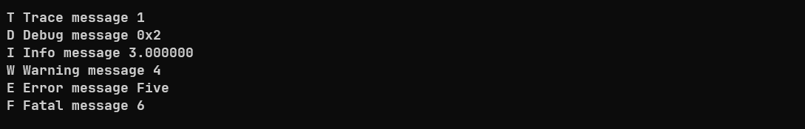

# microlog

[](https://github.com/an-dr/microlog/tags)
[](https://github.com/an-dr/microlog/actions/workflows/workflow-tests.yml)

A simple customizable logging library. Features:

- **Log topics**
  - To filter log messages by subsystems, e.g. "network", "storage", etc.
- **Callbacks for custom output**
  - E.g. multiplefiles, serial ports, etc.
- **Thread-safety**
  - Via external locking injection
- **Customizable log format**
  - Color, custom dynamic data, optional info, etc.
- **Support for embedded systems**
  - Optional static memory allocation, optional color, no special dependencies
- **Easy to install**
  - Just two files, and support for many build systems

In the default configuration it looks like this:


...but in can be very minimalistic



... or feature-rich:


The project is based on several core principles:

- Universal for embedded and desktop applications
- No feature - no code for compilation
- Shallow learning curve, works out of box
- No dependencies
- Two files

## Table of Contents

- [microlog](#microlog)
    - [Table of Contents](#table-of-contents)
    - [Quick Start](#quick-start)
        - [1. Install](#1-install)
        - [2. Use](#2-use)
    - [Contributing](#contributing)
    - [License](#license)
    - [Credits](#credits)

## Quick Start

### 1. Install

**Option 1 - Sources**:

- Download a Source Package from [Releases](https://github.com/an-dr/microlog/releases)
- Add sources to your system manually

**Option 2 - CMake Package (recommended CMake > 3.15.0)**:

- Download a CMake Package from [Releases](https://github.com/an-dr/microlog/releases)
- Specify the install location:
  - Specify package storage `cmake -B./build -DCMAKE_PREFIX_PATH="~/MyCmakePackages"` or
  - Set `microlog_DIR` variable with path to the package `microlog_DIR=~/microlog-1.2.3-cmake`
- Use in your project:

```cmake
find_package(microlog 1.2.3 REQUIRED)

add_executable(example_package example.cpp)
target_link_libraries(example_package PRIVATE microlog::microlog)

add_compile_definitions(ULOG_BUILD_COLOR=1) # configuration
```

**Option 3 - Meson Package**:

- Download a Meson Package from [Releases](https://github.com/an-dr/microlog/releases)
- Copy the content to `MyMesonProject/subprojects`
- Add to your dependencies:

```meson
add_global_arguments('-DULOG_BUILD_COLOR=1', language: ['cpp', 'c']) # configuration

exe = executable(
    meson.project_name(),
    src,
    include_directories: include,
    dependencies: dependency('microlog'),
)
```

**Option 4 - CPM:**

- Download CPM (https://github.com/cpm-cmake/CPM.cmake)
- Add microlog to your projects CMAKE file:

```cmake
include(cpm/CPM.cmake)
CPMAddPackage("gh:an-dr/microlog@6.4.5")
#Add other CPM packages

target_link_libraries(${PROJECT_NAME} PUBLIC microlog)
target_compile_definitions( microlog
        INTERFACE
        ULOG_BUILD_COLOR=1) # configuration
```

### 2. Use

```cpp
#include "ulog.h"

int main() {
    ulog_info("Hello, World");
    return 0;
}
```

Output:

```log
INFO  src/main.cpp:4: Hello, World
```

[See the example for more features in action.](example/main.cpp)

The full and detailed feature description is [here](doc/features.md).

## Contributing

Contributions are welcome! Please read the [CONTRIBUTING.md](CONTRIBUTING.md) for details, I tried to keep it simple.

## License

This library is free software; you can redistribute it and/or modify it under the terms of the MIT license. See [LICENSE](LICENSE) for details.

## Credits

Based on [https://github.com/rxi/log.c.git](https://github.com/rxi/log.c.git)
