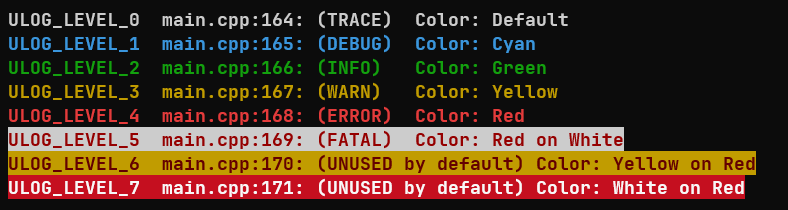

# Features

- [Features](#features)
    - [Core Features](#core-features)
        - [Static Configuration](#static-configuration)
        - [Logging, Levels and Outputs](#logging-levels-and-outputs)
        - [Events](#events)
        - [Lock](#lock)
    - [Optional Features](#optional-features)
        - [Topics](#topics)
        - [Extra Outputs](#extra-outputs)
            - [File Output](#file-output)
            - [User Defined Output](#user-defined-output)
        - [Prefix](#prefix)
        - [Time](#time)
        - [Color](#color)
        - [Source Location](#source-location)
        - [Level Style](#level-style)
        - [Dynamic Configuration](#dynamic-configuration)
            - [Topics Configuration](#topics-configuration)
            - [Prefix Configuration](#prefix-configuration)
            - [Time Configuration](#time-configuration)
            - [Color Configuration](#color-configuration)
            - [Source Location Configuration](#source-location-configuration)
            - [Level Configuration](#level-configuration)

This document describes the features of the logging library. There are optional and core features.

**Core Features** - are mandatory features requred by the library for the normal operation:

- **Print** - provides formatted printing to streams and buffers (not exposed to the users and used by other features internally)
- **Outputs** - printing endpoints logic and stdout output
- **Levels** - severity filters per **output**
- **Events** - containers to distribute logging info across **outputs**
- **Lock** - logic to inject external thread-safety mechanism
- **Logging** - logic that generates an **event** and dispatch it to **outputs**
- **Static Configuration** - compile-time logic to enable/disable optional features and configure core features

**Optional Features** - are configurable optional features that can extend the core library capabilities:

- **Color** - add ANSI colors to the output
- **Time** - add time stamps
- **Prefix** - add custom data after the time stamp
- **Extra Outputs** - additional user-defined outputs, including files
- **Source Location** - prints `file:line` location of a logging call
- **Level Style** - full or short severity level name
- **Topics** - label based message filtering
- **Dynamic Configuration** - run-time configuration of all features
- **Warnings Stubs for Non-Enabled Features** - generate stubs for disabled features with warning message or just fail linking if the function is disabled.

## Core Features

### Static Configuration

Part of features are configured compile-time. You can use defines in the compiler options, e.g. `-DULOG_BUILD_COLOR=1`.

For CMake projects, you can use the `add_compile_definitions` function.

```cmake
add_compile_definitions(ULOG_BUILD_COLOR=1)
```

For Meson projects, you can use the `meson` command.

```meson
add_global_arguments('-DULOG_BUILD_COLOR=1', language: 'c')
```

Note: For meson, you might want to adjust the compiler argument  `-fmacro-prefix-map=OLD_PATH=NEW_PATH` to to get the right file paths, e.g. for meson:

```meson
add_global_arguments('-fmacro-prefix-map=../=',language: 'c')
```

The full list of build options for static configuration is shown bellow:

| Build Option                | Default               | Purpose                  |
| --------------------------- | --------------------- | ------------------------ |
| ULOG_BUILD_COLOR            | 0                     | Compile color code paths |
| ULOG_BUILD_PREFIX_SIZE      | 0                     | Prefix buffer logic      |
| ULOG_BUILD_EXTRA_OUTPUTS    | 0                     | Extra output backends    |
| ULOG_BUILD_SOURCE_LOCATION  | 1                     | File\:line output        |
| ULOG_BUILD_LEVEL_STYLE      | ULOG_LEVEL_STYLE_LONG | Level style              |
| ULOG_BUILD_TIME             | 0                     | Timestamp support        |
| ULOG_BUILD_TOPICS_NUM       | 0                     | Topic filtering logic    |
| ULOG_BUILD_DYNAMIC_CONFIG   | 0                     | Runtime toggles          |
| ULOG_BUILD_WARN_NOT_ENABLED | 1                     | Warning stubs            |

### Logging, Levels and Outputs

There are 7 log severity levels:

- `ULOG_LEVEL_TRACE` - for tracing the execution path
- `ULOG_LEVEL_DEBUG` - for debug information
- `ULOG_LEVEL_INFO` - for general information
- `ULOG_LEVEL_WARN` - for important information
- `ULOG_LEVEL_ERROR` - for information about recoverable errors
- `ULOG_LEVEL_FATAL` - for information about condition causing the system failure

The library provides macros for logging with aliases:

```c
ulog_trace(const char *fmt, ...); // or log_trace(...)
ulog_debug(const char *fmt, ...); // or log_debug(...)
ulog_info(const char *fmt, ...); // or log_info(...)
ulog_warn(const char *fmt, ...); // or log_warn(...)
ulog_error(const char *fmt, ...); // or log_error(...)
ulog_fatal(const char *fmt, ...); // or log_fatal(...)
```

Each function takes a printf format string followed by additional arguments:

```c
ulog_info("Info message %f", 3.0)
```

The default log level is `ULOG_LEVEL_TRACE`, such that nothing is ignored. And by default there is only one available output - **stdout**. To configure its severity the user can use these two functions:

```c
ulog_output_level_set(ULOG_OUTPUT_STDOUT, ULOG_LEVEL_INFO);

// or

ulog_output_level_set_all(ULOG_LEVEL_TRACE);
```

In this case the stdout-printed line will be:

```txt
INFO  src/main.c:66: Info message 3.000000
```

### Events

The events care information depending on the static configuration. The whole list of possible data:

- Message
- Message format arguments
- Topic
- Time
- File
- Line
- Level

The data is accessible via getters (see header file for details):

- `ulog_event_get_message(...)`
- `ulog_event_get_topic(...)`
- `ulog_event_get_time(...)`
- `ulog_event_get_file(...)`
- `ulog_event_get_line(...)`
- `ulog_event_get_level(...)`

### Lock

If the log will be written to from multiple threads a lock function can be set. To do this use the `ulog_lock_set_fn()` function.
The function is passed the boolean `true` if the lock should be acquired or `false` if the lock should be released and the given `udata` value.

```c

void lock_function(bool lock, void *lock_arg) {
    if (lock) {
        pthread_mutex_lock((pthread_mutex_t *) lock_arg);
    } else {
        pthread_mutex_unlock((pthread_mutex_t *) lock_arg);
    }
}

. . .

pthread_mutex_t mutex;
ulog_lock_set_fn(lock_function, mutex);
```

## Optional Features

### Topics

- Static configuration options: `ULOG_BUILD_TOPICS_NUM`
- Values (int): `-1...INT_MAX`
- Default: `0`.

The feature is controlled by `ULOG_BUILD_TOPICS_NUM`. It allows to filter log messages by subsystems, e.g. "network", "storage", etc.

There are two mechanism of working with the topics:

- **Dynamic** allocation - slightly slower, but new topic will be added automatically
- **Static** allocation - faster, but you need to define all topic using `ulog_topic_add`

If you want to use dynamic topics, you need to define `ULOG_BUILD_TOPICS_NUM` to be -1. Otherwise, you need to define the number of topics for static allocation.

Printing the log message with the topic is done by the set of function-like macros similar to log_xxx, but with the topic as the first argument:

```c
ulog_topic_trace(const char *topic_name, const char *fmt, ...)  // or logt_trace(...)
ulog_topic_debug(const char *topic_name, const char *fmt, ...)  // or logt_debug(...)
ulog_topic_info(const char *topic_name, const char *fmt, ...)   // or logt_info(...)
ulog_topic_warn(const char *topic_name, const char *fmt, ...)   // or logt_warn(...)
ulog_topic_error(const char *topic_name, const char *fmt, ...)  // or logt_error(...)
ulog_topic_fatal(const char *topic_name, const char *fmt, ...)  // or logt_fatal(...)
```

In static mode you can decide whether enable or disable the topic during its definition. In dynamic mode all topics are disabled by default.

For example (static topics):

```c
ulog_topic_add("network", true); // enabled by default
ulog_topic_add("storage", false); // disabled by default

ulog_topic_info("network", "Connected to server");

ulog_topic_enable("storage");
ulog_topic_warn("storage", "No free space");
```

or dynamic topics:

```c
// by default all topics are disabled
ulog_topic_enable("storage");
ulog_topic_error("storage", "No free space");

ulog_topic_enable_all();
ulog_topic_trace("network", "Disconnected from server");
ulog_topic_fatal("video", "No signal");
```

By default, the logging level of each topic is set to `ULOG_LEVEL_TRACE`. It is possible to alter this behavior by calling `ulog_topic_level_set()`. All topics below the level set by `ulog_output_level_set()` (`ULOG_LEVEL_TRACE` by default) will not generate log.

For example:

```c
// By default, both topic logging levels are set to ULOG_LEVEL_TRACE
ulog_topic_add("network", true);
ulog_topic_add("storage", true);

// Both topics generate log as global logging level is set to ULOG_LEVEL_TRACE
ulog_topic_info("network", "Connected to server");
ulog_topic_warn("storage", "No free space");

ulog_output_level_set_all(ULOG_LEVEL_INFO); // All outputs are set to INFO
ulog_topic_level_set("storage", ULOG_LEVEL_WARN); // Storage is set to WARN

ulog_topic_info("storage", "No free space"); // generated
ulog_topic_info("network", "Connected to server"); // filtered out topic
ulog_topic_debug("storage", "No free space"); // filtered out level DEBUG < INFO
```

### Extra Outputs

- Static configuration options: `ULOG_BUILD_EXTRA_OUTPUTS`
- Values (int): `0...INT_MAX`
- Default: `0`.

The feature is controlled by the following define:

- `ULOG_BUILD_EXTRA_OUTPUTS` - The maximum number of extra logging outputs that can be added. Each extra output requires some memory. When it is 0, the only available output is STDOUT. Default is 0.

#### File Output

One or more file pointers where the log will be written can be provided to the library by using the `ulog_output_add_file()` function. The data written to the file output is of the following format (with the full time stamp):

```txt
2047-03-11 20:18:26 TRACE src/main.c:11: Hello world

vs

20:18:26 TRACE src/main.c:11: Hello world
```

To write to a file open a file and pass it to the `ulog_output_add_file` function.

```c
FILE *fp = fopen("log.txt", "w");
if (fp) {
    ulog_output_id file_output = ulog_output_add_file(fp, ULOG_LEVEL_INFO);
    if (file_output != ULOG_OUTPUT_INVALID) {
        ulog_topic_info("Outputs", "File output added");
        ulog_output_level_set(file_output, ULOG_LEVEL_TRACE);
        ulog_topic_trace("Outputs", "File output level set to TRACE");
    }
    ulog_output_remove(file_output);  // For demo purposes
    fclose(fp);  // For demo purposes
}
```

#### User Defined Output

One or more callback functions which are called with the log data can be provided to the library by using the `ulog_output_add()` function. You can use `ulog_event_to_cstr` to convert the `ulog_event` structure to a string.

```c
void arduino_callback(ulog_event *ev, void *arg) {
    static char buffer[128];
    int result = ulog_event_to_cstr(ev, buffer, sizeof(buffer));
    if (result == 0) {
        Serial.println(buffer);
    }
}

. . .

ulog_output_id ard_output = ulog_output_add(arduino_callback, NULL, ULOG_LEVEL_INFO);
if (ard_output != ULOG_OUTPUT_INVALID) {
    ulog_info("Will be printed to Arduino serial");
    ulog_output_remove(ard_output); // For demo purposes
}

```

### Prefix

- Static configuration options: `ULOG_BUILD_PREFIX_SIZE`
- Values (int): `0...INT_MAX`
- Default: `0`.

Sets a prefix function that can be used to customize the log output. The function is called with the log event and should fill a string (`prefix`) that will be printed right before the log level. It can be used to add custom data to the log messages, e.g. millisecond time.

Requires `ULOG_BUILD_PREFIX_SIZE` to be more than 0.

```c
void update_prefix(ulog_event *ev, char *prefix, size_t prefix_size) {
    snprintf(prefix, prefix_size, ", %03d ms", millis());
}
// . . .
ulog_prefix_set_fn(prefix_fn);
```

The output will be:

```txt
19:51:42, 005 ms ERROR src/main.c:38: Error message
```

### Time

- Static configuration options: `ULOG_BUILD_TIME`
- Values (bool): `0/1`
- Default: `0`.

Prints a time stamp in from of all log messages. Your platform must support `time.h`.

The time to the file output will be written with the date, while time to the console and other outputs will be written with the time only.

```txt
log.txt:

2021-03-11 20:18:26 TRACE src/main.c:11: Hello world

console:

20:18:26 TRACE src/main.c:11: Hello world
```

### Color

- Static configuration options: `ULOG_BUILD_COLOR`
- Values (bool): `0/1`
- Default: `0`.

Use ANSI color escape codes when printing to stdout. If the terminal supports, the output will be colorized.

- TRACE - white
- DEBUG - cyan
- INFO - green
- WARN - yellow
- ERROR - red
- FATAL - magenta



### Source Location

- Static configuration options: `ULOG_BUILD_SOURCE_LOCATION`
- Values (bool): `0/1`
- Default: `1`.

Hide or show the file name and line number. See output examples below:

- ULOG_BUILD_SOURCE_LOCATION=0: `TRACE Hello world`
- ULOG_BUILD_SOURCE_LOCATION=1: `TRACE src/main.c:11: Hello world`

### Level Style

- Static configuration options: `ULOG_BUILD_LEVEL_STYLE`
- Values (bool/enum): `0/1`, `ULOG_LEVEL_STYLE_LONG/ULOG_LEVEL_STYLE_SHORT`
- Default: `ULOG_LEVEL_STYLE_LONG`.

Allows to use short level strings, e.g. "T" for "TRACE", "I" for "INFO":

- ULOG_BUILD_LEVEL_STYLE=ULOG_LEVEL_STYLE_LONG: `TRACE src/main.c:11: Hello world`
- ULOG_BUILD_LEVEL_STYLE=ULOG_LEVEL_STYLE_SHORT: `T src/main.c:11: Hello world`

### Dynamic Configuration

- Static configuration options: `ULOG_BUILD_DYNAMIC_CONFIG`
- Values (bool): `0/1`
- Default: `0`.

Most of the library features are configured compile time to reduce the code size and complexity. However, if the code size is not a concern, you can enable Dynamic Config by defining `ULOG_BUILD_DYNAMIC_CONFIG=1`. When the feature is enables all other features are enabled too in some default mode described in bellow. All Dynamic Config functions named like: `ulog_FEATURE_config`. The default configuration is following:

| Build Config                | Default Value                  |
| --------------------------- | ------------------------------ |
| ULOG_BUILD_PREFIX_SIZE      | 64                             |
| ULOG_BUILD_EXTRA_OUTPUTS    | 8                              |
| ULOG_BUILD_TIME             | 1                              |
| ULOG_BUILD_SOURCE_LOCATION  | 1                              |
| ULOG_BUILD_COLOR            | 1                              |
| ULOG_BUILD_LEVEL_STYLE      | ULOG_LEVEL_STYLE_LONG +\_SHORT |
| ULOG_BUILD_TOPICS_NUM       | -1                             |
| ULOG_BUILD_WARN_NOT_ENABLED | 0                              |

#### Topics Configuration

If Dynamic Config enabled topics are created runtime in the **dynamic allocation mode**.

Configuration functions:

- `void ulog_topic_config(bool enabled)` - will show or hide topics in the log output when printing using `ulog_topic_xxx` macros.

Example output with and without topics:

```c
ulog_topic_info("WORLD", "Hello");
```

- enabled=true:  `INFO  [WORLD] src/main.c:13: Hello`
- enabled=false: `INFO  src/main.c:13: Hello`

#### Prefix Configuration

If Dynamic Config enabled, `ULOG_BUILD_PREFIX_SIZE` is set to 64, so the prefix will be limited to: 63 characters + 1 null terminator.

Functions to configure the prefix:

- `void ulog_prefix_config(bool enabled)` - will enable or disable prefix in the log output.

#### Time Configuration

Functions to configure the timestamp:

- `void ulog_time_config(bool enabled)` - will enable or disable time in the log output.

#### Color Configuration

Functions to configure:

- `void ulog_color_config(bool enabled)` - will enable or disable ANSI color escape codes when printing to stdout.

#### Source Location Configuration

Functions to configure:

- `void ulog_source_location_config(bool enabled)` - will show or hide file and line in the log output.

#### Level Configuration

Functions to configure:

- `void ulog_level_config(ulog_level_config_style style)` - will enable or disable short level strings, e.g. "T" for "TRACE", "I" for "INFO".

The `style` argument can be one of the following values:

- `ULOG_LEVEL_CONFIG_STYLE_DEFAULT`: long level strings (default)
- `ULOG_LEVEL_CONFIG_STYLE_SHORT`: short level strings
